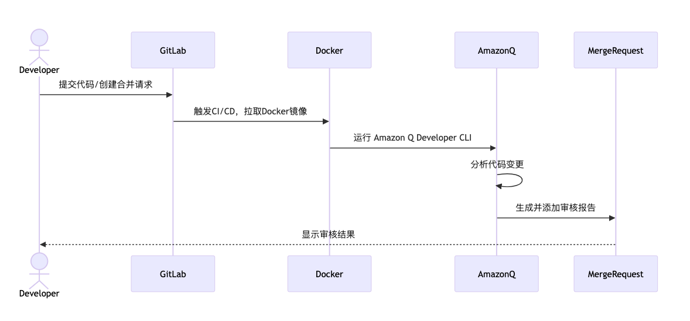

## 简介
基于Amazon Q developer的Gitlab代码审核实现基于以下流程：

1. 开发者提交代码或创建合并请求
2. GitLab CI/CD 流程触发
3. 使用预配置的 Docker 镜像运行 Amazon Q Developer CLI进行代码审核
4. Amazon Q Developer CLI 分析代码变更并生成审核报告
5. 审核结果作为评论添加到合并请求中



Gitlab中的项目仓库结构如下：
```
.
├── .gitlab-ci.yml #gitlab cicd 所用的pipeline
├── Dockerfile # gitlab pipeline运行时所用docker 镜像
├── ewallet # 测试使用的代码,在您的环境中，此为您的项目代码
├── improve_rules # 审核规则
│   ├── improved_code_review_standards_part1.md #包含一般原则、代码审查流程和检查清单的第一部分（代码风格和代码质量）
│   ├── improved_code_review_standards_part2.md #包含功能实现、安全性和性能部分
│   ├── improved_code_review_standards_part3.md #包含测试、日志记录、可维护性和特定场景，如并发、事务、幂等性和远程调用
│   ├── improved_code_review_standards_part4.md #包含语言特定的检查点、中间件使用指南、通信指南、工具推荐和持续改进
│   └── llm_code_review_feedback_format.md # 审核报告规则
└── put_comment.py # 审核结束调用api填写评论的代码
```

## 如何使用？
将本项目中`ewallet`的部分替换为您的项目代码即可，Gitlab中的设置可参考此[Blog](https://aws.amazon.com/cn/blogs/china/using-amazon-q-developer-to-build-an-enterprise-automated-code-review-process)

## 注意事项

您需要安装[amazon-ecr-credential-helper](https://github.com/awslabs/amazon-ecr-credential-helper)以自动处理ECR镜像拉取的权限问题
以下为amzn2023 或 amzn2的安装方式：
```
# 安装amazon-ecr-credential-helper用于处理ecr的权限问题
          if uname -r | grep -q amzn2023; then
            dnf install -y amazon-ecr-credential-helper
          fi        
          if uname -r | grep -q amzn2; then
            amazon-linux-extras enable docker
            yum install amazon-ecr-credential-helper 
          fi

          mkdir /root/.docker
          cat > /root/.docker/config.json << 'EOF'
          {
            "credHelpers": {
              "public.ecr.aws": "ecr-login",
              "${AWS::AccountId}.dkr.ecr.${AWS::Region}.amazonaws.com": "ecr-login"
            }
          }
          EOF
```